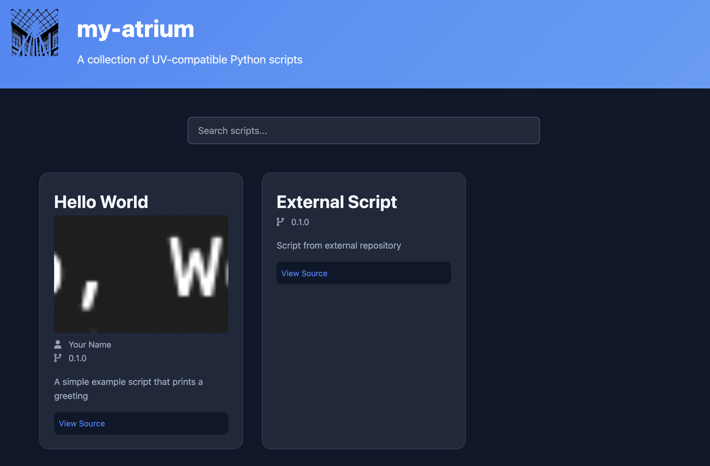

# Atrium

A template for creating collections of UV-compatible Python scripts with automatic documentation generation and deployment.



## Features

- 🚀 Automatic documentation generation
- 📦 UV-compatible script distribution
- 🔄 GitHub Pages integration
- 🎨 Clean, responsive web interface
- 🛠️ Command-line tool support

## Quick Start

1. Create your atrium:
```bash
uvx copier copy --trust https://github.com/kephale/atrium my-atrium
cd my-atrium
```

2. Configure GitHub Pages:

- Go to repository Settings > Pages
- Set source to GitHub Actions

3. Add your first script:

```bash
mkdir -p examples/my-script
touch examples/my-script/0.1.0.py
```

## Updating an existing `atrium`

Note: this uses the `--trust` flag because of the template.

```
uvx copier update --trust
```

## Script metadata

The following metadata is required in each `uv` script.

```python
# /// script
# title = "Script Title"
# description = "Detailed description"
# author = "Author Name <email@example.com>"
# version = "1.0.0"
# dependencies = [
#     "package1>=1.0.0",
#     "package2>=2.0.0"
# ]
# ///
```

## Troubleshooting

### Common Issues

1. GitHub Pages not deploying

- Ensure GitHub Actions has required permissions
- Check workflow runs for specific errors

2. Script metadata not parsing

- Verify metadata format matches example
- Check for syntax errors in dependencies list

## Security

- Always be aware of the code you're running
- Scripts are executed in isolated environments
- Dependencies are verified against requirements
- UV provides secure script execution

## License
MIT License - See LICENSE for details
